# Design Document

## Overview

The ECR connectivity issue is caused by missing network infrastructure components required for ECS Fargate tasks in private subnets to pull Docker images from ECR. The primary issue is the absence of an S3 VPC endpoint, which is essential for downloading ECR image layers. Additionally, there may be security group and IAM permission gaps that need to be addressed.

## Architecture

The solution involves a multi-layered approach to ensure complete ECR connectivity:

```mermaid
graph TB
    subgraph "Private Subnet"
        ECS[ECS Fargate Task]
        RT[Private Route Table]
        WIN[Windows EC2 File Server]
    end

    subgraph "VPC Endpoints"
        ECRAPI[ECR API Endpoint ✅]
        ECRDKR[ECR DKR Endpoint ✅]
        S3EP[S3 Gateway Endpoint ✅]
        CWLOGS[CloudWatch Logs Endpoint ✅]
        SSM[SSM Endpoint ✅]
        SSMMSG[SSM Messages Endpoint ✅]
        EC2MSG[EC2 Messages Endpoint ✅]
        SM[Secrets Manager Endpoint ✅]
        CF[CloudFormation Endpoint ✅]
    end

    subgraph "Security Groups"
        ECSSG[ECS Security Group]
        VPCESG[VPC Endpoint Security Group]
        WINSG[Windows Security Group]
    end

    subgraph "AWS Services"
        ECR[ECR Registry]
        S3[S3 - ECR Image Layers]
        CWL[CloudWatch Logs]
        SSMSERV[SSM Service]
        SMSERV[Secrets Manager Service]
    end

    ECS -->|1. Authentication| ECRAPI
    ECS -->|2. Image Manifest| ECRDKR
    ECS -->|3. Image Layers| S3EP
    ECS -->|4. Logging| CWLOGS
    ECS -->|5. SMB Connection| WIN
    WIN -->|6. Session Manager| SSMMSG
    WIN -->|7. EC2 Messages| EC2MSG
    WIN -->|8. AWS Services| ECRAPI
    WIN -->|9. Parameter Store| SSM
    WIN -->|10. Secrets Access| SM

    ECSSG -.->|HTTPS 443| VPCESG
    ECSSG -.->|SMB 445, NetBIOS 139| WINSG
    ECSSG -.->|RPC 135, Dynamic 1024-65535| WINSG
    ECSSG -.->|DNS 53| RT
    ECSSG -.->|Fallback HTTPS| RT
    WINSG -.->|HTTPS 443| VPCESG
    WINSG -.->|DNS 53| RT
    WINSG -.->|Fallback HTTPS| RT

    S3EP -.->|Route Table| RT
    RT -.->|Gateway Route| S3EP

    ECRAPI --> ECR
    ECRDKR --> ECR
    S3EP --> S3
    CWLOGS --> CWL
    SSM --> SSMSERV
    SSMMSG --> SSMSERV
    EC2MSG --> SSMSERV
    SM --> SMSERV

    style S3EP fill:#90EE90
    style ECRAPI fill:#90EE90
    style ECRDKR fill:#90EE90
    style CWLOGS fill:#90EE90
    style SSM fill:#90EE90
    style SSMMSG fill:#90EE90
    style EC2MSG fill:#90EE90
    style SM fill:#90EE90
    style CF fill:#90EE90
    style ECS fill:#87CEEB
```



## Components and Interfaces

### 1. S3 Gateway VPC Endpoint ✅ IMPLEMENTED

**Purpose**: Enable access to S3 for downloading ECR image layers
**Type**: Gateway endpoint (routes through route table)
**Configuration**:

- ✅ Attached to private subnet route table
- ✅ Allows access to S3 service in the same region
- ✅ No security groups required (gateway endpoint)
- ✅ Includes policy for ECR starport layer bucket access
- ✅ Supports both specific ECR bucket and general S3 access with repository tags

### 2. VPC Interface Endpoints ✅ IMPLEMENTED

**Purpose**: Enable private access to AWS services without internet gateway
**Endpoints Configured**:

- ✅ ECR API Endpoint - Authentication and registry operations
- ✅ ECR DKR Endpoint - Docker image manifest and metadata
- ✅ CloudWatch Logs Endpoint - Application logging
- ✅ SSM Endpoint - Parameter store access and instance management
- ✅ SSM Messages Endpoint - Session Manager communication channels
- ✅ EC2 Messages Endpoint - Session Manager message handling
- ✅ Secrets Manager Endpoint - Secret retrieval
- ✅ CloudFormation Endpoint - Stack signaling (Windows EC2)

### 3. Enhanced Security Group Rules ✅ IMPLEMENTED

**Purpose**: Ensure proper HTTPS access to VPC endpoints and comprehensive SMB connectivity
**Configuration**:

**ECS to VPC Endpoints**:

- ✅ ECS security group allows outbound HTTPS (443) to VPC endpoint security group
- ✅ ECS security group allows outbound DNS (53 UDP/TCP) for endpoint resolution
- ✅ ECS security group includes fallback HTTPS (443) rule to 0.0.0.0/0 for redundancy
- ✅ VPC endpoint security group allows inbound HTTPS (443) from ECS security group

**ECS to Windows EC2 - Complete SMB Protocol Suite**:

- ✅ ECS security group allows outbound SMB (445) to Windows EC2 security group
- ✅ ECS security group allows outbound NetBIOS (139) to Windows EC2 security group
- ✅ ECS security group allows outbound RPC Endpoint Mapper (135) to Windows EC2 security group
- ✅ ECS security group allows outbound Dynamic RPC ports (1024-65535) to Windows EC2 security group

**Windows EC2 Outbound Rules**:

- ✅ Windows EC2 security group allows outbound HTTPS (443) to 0.0.0.0/0 for AWS services (fallback)
- ✅ Windows EC2 security group allows outbound HTTPS (443) to VPC endpoint security group for AWS services
- ✅ Windows EC2 security group allows outbound DNS (53 UDP) to 0.0.0.0/0 for name resolution
- ✅ Windows EC2 security group allows outbound DNS (53 TCP) to 0.0.0.0/0 for name resolution
- ✅ Windows EC2 security group allows outbound DNS (53 UDP) to VPC CIDR for VPC endpoint resolution
- ✅ Windows EC2 security group allows outbound DNS (53 TCP) to VPC CIDR for VPC endpoint resolution

**Windows EC2 Inbound Rules**:

- ✅ Windows EC2 security group allows inbound SMB (445) from ECS security group
- ✅ Windows EC2 security group allows inbound NetBIOS (139) from ECS security group
- ✅ Windows EC2 security group allows inbound RPC Endpoint Mapper (135) from ECS security group
- ✅ Windows EC2 security group allows inbound Dynamic RPC ports (1024-65535) from ECS security group

### 4. IAM Permissions ✅ IMPLEMENTED

**Purpose**: Ensure ECS task execution role has all required ECR and AWS service permissions
**ECS Task Execution Role Permissions**:

- ✅ `ecr:GetAuthorizationToken` - ECR authentication
- ✅ `ecr:BatchCheckLayerAvailability` - Layer availability checks
- ✅ `ecr:GetDownloadUrlForLayer` - Layer download URLs
- ✅ `ecr:BatchGetImage` - Image manifest retrieval
- ✅ `s3:GetObject`, `s3:GetObjectVersion` - ECR image layer downloads from S3
- ✅ `secretsmanager:GetSecretValue` - Application secrets access
- ✅ `ssm:GetParameter*` - Parameter store access
- ✅ `logs:CreateLogGroup`, `logs:CreateLogStream`, `logs:PutLogEvents` - CloudWatch logging
- ✅ `logs:DescribeLogStreams`, `logs:DescribeLogGroups` - Log management

### 5. ECS Runtime Platform Configuration ✅ IMPLEMENTED

**Purpose**: Explicitly define the runtime platform for ECS Fargate tasks to ensure proper image compatibility
**Configuration**:

- ✅ `CpuArchitecture: ARM64` - Specifies ARM 64-bit architecture (Graviton processors)
- ✅ `OperatingSystemFamily: LINUX` - Defines Linux as the container OS
- ✅ Ensures compatibility with Docker images built for ARM64 Linux platforms
- ✅ Prevents potential runtime issues from architecture mismatches
- ✅ Leverages AWS Graviton processors for improved price-performance ratio

### 6. Session Manager Support ✅ IMPLEMENTED

**Purpose**: Enable secure remote access to Windows EC2 instance without SSH/RDP or bastion hosts
**Components**:

- ✅ **SSM Messages Endpoint**: Handles Session Manager control and data channel communication
  - Supports `ssmmessages:CreateControlChannel`, `ssmmessages:CreateDataChannel`
  - Enables `ssmmessages:OpenControlChannel`, `ssmmessages:OpenDataChannel`
- ✅ **EC2 Messages Endpoint**: Manages message acknowledgment and processing for Session Manager
  - Supports `ec2messages:AcknowledgeMessage`, `ec2messages:DeleteMessage`, `ec2messages:FailMessage`
  - Enables `ec2messages:GetEndpoint`, `ec2messages:GetMessages`, `ec2messages:SendReply`
- ✅ **Enhanced SSM Endpoint**: Extended with additional permissions for Session Manager functionality
  - Added `ssm:UpdateInstanceInformation`, `ssm:SendCommand`, `ssm:ListCommandInvocations`
  - Includes `ssm:DescribeInstanceInformation`, `ssm:GetCommandInvocation`

**Benefits**:

- **Secure Access**: No need for SSH/RDP ports or bastion hosts
- **Audit Trail**: All session activity logged through CloudTrail
- **Network Isolation**: Access maintained within private subnet via VPC endpoints
- **Cost Effective**: No additional NAT Gateway or Internet Gateway required for management access

### 7. DNS Resolution ✅ IMPLEMENTED

**Purpose**: Ensure ECR service names resolve to VPC endpoint IPs
**Components**:

- ✅ VPC DNS resolution enabled
- ✅ VPC DNS hostnames enabled
- ✅ Private DNS enabled on all VPC endpoints

## Data Models

### ECR Connectivity Test Result

```json
{
  "testId": "string",
  "timestamp": "ISO8601",
  "tests": [
    {
      "name": "S3_VPC_ENDPOINT",
      "status": "PASS|FAIL",
      "details": "string",
      "recommendation": "string"
    },
    {
      "name": "ECR_API_CONNECTIVITY",
      "status": "PASS|FAIL",
      "details": "string",
      "recommendation": "string"
    },
    {
      "name": "ECR_DKR_CONNECTIVITY",
      "status": "PASS|FAIL",
      "details": "string",
      "recommendation": "string"
    },
    {
      "name": "IAM_PERMISSIONS",
      "status": "PASS|FAIL",
      "details": "string",
      "recommendation": "string"
    },
    {
      "name": "DNS_RESOLUTION",
      "status": "PASS|FAIL",
      "details": "string",
      "recommendation": "string"
    }
  ],
  "overallStatus": "PASS|FAIL",
  "summary": "string"
}
```

## Error Handling

### Connection Timeout Scenarios

1. **S3 Gateway Endpoint Missing**: Add S3 gateway endpoint to route table
2. **Security Group Blocking**: Update security group rules for HTTPS access
3. **DNS Resolution Failure**: Verify VPC DNS settings and endpoint configuration
4. **IAM Permission Denied**: Update task execution role with required ECR permissions

### Retry Logic

- Implement exponential backoff for ECR API calls
- Maximum retry attempts: 3
- Initial retry delay: 2 seconds
- Maximum retry delay: 30 seconds

### Monitoring and Alerting

- CloudWatch metrics for ECR pull success/failure rates
- Custom metrics for VPC endpoint connectivity
- Alarms for sustained ECR connectivity failures

## Testing Strategy

### Unit Tests

- VPC endpoint configuration validation
- Security group rule verification
- IAM permission checking utilities
- DNS resolution testing functions

### Integration Tests

- End-to-end ECR image pull from ECS task
- VPC endpoint connectivity verification
- Cross-service communication testing

### Diagnostic Tools

- ECR connectivity test script for ECS tasks
- VPC endpoint health check utility
- Network connectivity validation tool
- IAM permission audit script

### Test Scenarios

1. **Successful Image Pull**: Verify complete ECR pull workflow
2. **S3 Endpoint Failure**: Test behavior when S3 endpoint is unavailable
3. **Security Group Blocking**: Test with restrictive security group rules
4. **IAM Permission Failure**: Test with insufficient permissions
5. **DNS Resolution Failure**: Test with DNS configuration issues

## Implementation Phases

### Phase 1: Infrastructure Fixes ✅ COMPLETED

- ✅ Add S3 gateway VPC endpoint to CloudFormation template
- ✅ Update security group rules for proper HTTPS access
- ✅ Verify and update IAM permissions
- ✅ Configure all required VPC endpoints (ECR API, ECR DKR, CloudWatch Logs, SSM, Secrets Manager, CloudFormation)
- ✅ Implement comprehensive security group rules with fallback connectivity
- ✅ Add explicit runtime platform configuration (ARM64/LINUX) to ECS task definition

### Phase 2: Diagnostic Tools 🔄 IN PROGRESS

- Create ECR connectivity test script
- Implement VPC endpoint health checks
- Add comprehensive logging for troubleshooting

### Phase 3: Monitoring and Alerting

- Set up CloudWatch metrics and alarms
- Create dashboards for ECR connectivity monitoring
- Implement automated remediation where possible

## Security Considerations

- VPC endpoints restrict traffic to AWS backbone network
- Security groups provide network-level access control with comprehensive SMB protocol support
- IAM roles follow principle of least privilege
- All communications use HTTPS/TLS encryption for AWS services
- SMB communications secured through security group isolation (ECS ↔ Windows EC2 only)
- Complete SMB protocol suite enabled: SMB (445), NetBIOS (139), RPC (135), and Dynamic RPC (1024-65535)
- No internet gateway required, maintaining private subnet isolation
- Dynamic RPC port range (1024-65535) restricted to communication between ECS and Windows EC2 security groups only

## Cost Analysis

### Infrastructure Cost Breakdown (Monthly Estimates - US East 1)

**VPC Endpoints (Interface)**:

- ECR API Endpoint: ~$7.30/month (730 hours × $0.01/hour)
- ECR DKR Endpoint: ~$7.30/month (730 hours × $0.01/hour)
- CloudWatch Logs Endpoint: ~$7.30/month (730 hours × $0.01/hour)
- SSM Endpoint: ~$7.30/month (730 hours × $0.01/hour)
- SSM Messages Endpoint: ~$7.30/month (730 hours × $0.01/hour)
- EC2 Messages Endpoint: ~$7.30/month (730 hours × $0.01/hour)
- Secrets Manager Endpoint: ~$7.30/month (730 hours × $0.01/hour)
- CloudFormation Endpoint: ~$7.30/month (730 hours × $0.01/hour)

**VPC Endpoints (Gateway)**:

- S3 Gateway Endpoint: **$0/month** (No hourly charges for gateway endpoints)

**ECS Infrastructure**:

- ECS Fargate Task (256 CPU, 512 MB, ARM64): ~$0.032/hour when running (20% cost savings vs X86_64)
- CloudWatch Log Group: ~$0.50/GB ingested + $0.03/GB stored

**Windows EC2 Infrastructure**:

- t3.micro Windows Instance: ~$16.79/month (730 hours × $0.023/hour)
- 20GB gp3 EBS Volume: ~$1.60/month (20GB × $0.08/GB)

**Configuration Management**:

- SSM Parameter Store: ~$0.05/month (standard parameters under free tier)
- AWS Secrets Manager: ~$0.40/month (SMB credentials storage)

**Total Monthly Cost**: ~$77.14/month + data transfer costs

**Recent Infrastructure Updates (February 2025)**:

1. **SSM Parameter Store Migration**: Deployment configuration migrated from file-based to SSM Parameter Store-based management, adding ~$0.45/month for enhanced configuration management
2. **CloudFormation Export Removal**: CloudFormation exports were removed from the main template outputs to simplify the architecture. This change does not affect infrastructure costs or functionality - all resources remain accessible via stack outputs for internal communication.

**Note**: The ARM64 runtime platform configuration provides approximately 20% cost savings for ECS Fargate tasks compared to X86_64, while maintaining the same functionality. This architecture change requires Docker images to be built for ARM64/Linux platforms.

**Security Group Impact**: The enhanced SMB security group rules and Windows EC2 outbound connectivity rules do not incur additional costs but provide comprehensive protocol support for reliable Windows file server connectivity and AWS service access.

**⚠️ CONFIGURATION NOTICE**: The recent changes added explicit egress rules to the Windows EC2 Security Group definition, which may create rule duplication with the separate security group rules defined later in the template. This could potentially cause CloudFormation deployment issues due to conflicting or duplicate rules.

### Current Infrastructure Status

**✅ FULLY IMPLEMENTED**: All ECR connectivity infrastructure is now in place:

- **S3 Gateway Endpoint**: Enables ECR image layer downloads with no additional cost
- **Complete VPC Endpoint Suite**: All 8 interface endpoints configured for full AWS service access
- **Enhanced Session Manager Support**: SSM Messages and EC2 Messages endpoints enable secure remote access to Windows EC2 instance
- **Comprehensive Security Groups**: Proper HTTPS, SMB, and DNS connectivity rules implemented
- **Enhanced IAM Permissions**: Full ECR and AWS service access for ECS tasks
- **Fallback Connectivity**: ECS security group includes fallback HTTPS rule for redundancy
- **Runtime Platform Specification**: Explicit ARM64/LINUX configuration ensures container compatibility and cost optimization

**Benefits Achieved**:

- ✅ **Zero Additional Cost**: S3 Gateway endpoint provides ECR layer access at no extra charge
- ✅ **Enhanced Security**: All traffic remains within AWS backbone via VPC endpoints
- ✅ **Improved Reliability**: Multiple connectivity paths ensure robust ECR access
- ✅ **Complete Isolation**: No internet gateway dependency while maintaining full functionality
- ✅ **Comprehensive Coverage**: All AWS services required by the application are accessible
- ✅ **Platform Compatibility**: Explicit ARM64 runtime platform prevents architecture-related deployment issues and provides cost optimization
- ✅ **Enhanced SMB Connectivity**: Complete SMB protocol suite support ensures reliable Windows file server communication
- ✅ **Enhanced Windows Connectivity**: Windows EC2 instance now has explicit outbound rules for AWS services and DNS resolution
- ✅ **Secure Remote Access**: Session Manager enables secure Windows EC2 management without exposing RDP/SSH ports
- ✅ **Simplified Operations**: No bastion hosts or VPN required for Windows server administration

**Data Transfer Optimization**:

- ECR image pulls via S3 gateway endpoint: No additional charges within same region
- Estimated savings: $0.09/GB compared to NAT Gateway or Internet Gateway routing
- Reduced latency and improved performance for container image pulls

**SMB Protocol Enhancement**:

- **Complete Protocol Support**: All required SMB-related ports configured for reliable Windows file server connectivity
- **Port Coverage**: SMB (445), NetBIOS (139), RPC Endpoint Mapper (135), Dynamic RPC (1024-65535)
- **Security Isolation**: All SMB traffic restricted to communication between ECS tasks and Windows EC2 instance only
- **Reliability Improvement**: Comprehensive port coverage eliminates potential SMB connectivity issues
- **No Additional Cost**: Security group rule enhancements do not incur additional charges

**Windows EC2 Connectivity Enhancement**:

- **Explicit Outbound Rules**: Windows EC2 security group now includes explicit egress rules for AWS service access
- **Dual DNS Configuration**: Both global (0.0.0.0/0) and VPC-specific DNS resolution rules for maximum compatibility
- **Fallback HTTPS Access**: Direct HTTPS access to AWS services as backup to VPC endpoints
- **Improved Reliability**: Multiple connectivity paths ensure robust AWS service access from Windows instance
- **⚠️ Rule Duplication Risk**: Recent changes may have created duplicate rules that need consolidation

**ARM64 Architecture Benefits**:

- **Cost Savings**: ~20% reduction in ECS Fargate compute costs compared to X86_64
- **Performance**: AWS Graviton processors provide improved price-performance ratio
- **Energy Efficiency**: ARM64 architecture typically offers better power efficiency
- **Compatibility**: Requires Docker images to be built specifically for ARM64/Linux platform

**Migration Considerations**:

- **Docker Images**: All container images must be rebuilt for ARM64 architecture
- **Dependencies**: Ensure all application dependencies support ARM64
- **Testing**: Comprehensive testing required to validate ARM64 compatibility
- **CI/CD Pipeline**: Build pipeline must be updated to target ARM64 architecture

### Recent Enhancement: Windows Server 2022 Password Compliance Validation

**Change Summary**: Enhanced the Windows EC2 UserData script with strict password validation that enforces Windows Server 2022 complexity requirements without automatic modification.

**Implementation Details**:

- **Strict Validation**: Script now performs comprehensive password validation before user creation
- **Length Validation**: Enforces minimum 8-character password length requirement
- **Complexity Validation**: Validates that password contains at least 3 of 4 character types:
  - Uppercase letters (A-Z)
  - Lowercase letters (a-z)
  - Digits (0-9)
  - Special characters (!@#$%^&\*()\_+-=[]{}|;:",.<>?)
- **Fail-Fast Approach**: Throws descriptive errors if password requirements are not met
- **Enhanced Logging**: Provides detailed logging of validation results and error conditions
- **User Creation Improvements**: Added explicit parameter specification and user verification

**Key Changes**:

- **No Automatic Password Modification**: Removed automatic password enhancement to maintain security integrity
- **Comprehensive Error Reporting**: Detailed error messages specify exactly which requirements are not met
- **User Creation Verification**: Added post-creation verification to confirm user was created successfully
- **Enhanced Error Handling**: Full exception details logged for troubleshooting
- **Explicit Parameter Control**: User creation uses explicit boolean parameters for better control

**Benefits**:

- **Security Integrity**: Passwords are not automatically modified, maintaining user-provided credentials
- **Clear Requirements**: Explicit validation provides clear feedback on password requirements
- **Improved Reliability**: Enhanced error handling and verification steps reduce deployment failures
- **Better Troubleshooting**: Comprehensive logging aids in diagnosing password-related issues
- **Compliance Assurance**: Strict validation ensures Windows Server 2022 password policy compliance

**Security Considerations**:

- **No Password Modification**: Original password integrity maintained throughout process
- **Validation Only**: Script validates but does not alter user-provided passwords
- **Clear Error Messages**: Helps users understand exact requirements without exposing password content
- **Secure Parameter Handling**: CloudFormation NoEcho property continues to protect password parameters
- **Explicit User Control**: User creation parameters explicitly defined for security clarity

**Cost Impact**: No cost impact - this is a script enhancement that improves reliability and security without affecting infrastructure resources.

## Recent Infrastructure Changes Analysis

### Windows EC2 Security Group Modifications

**Change Summary**: The Windows EC2 Security Group (`WindowsEC2SecurityGroup`) was modified to include explicit egress rules directly in the security group definition:

```yaml
SecurityGroupEgress:
  - IpProtocol: tcp
    FromPort: 443
    ToPort: 443
    CidrIp: 0.0.0.0/0
    Description: "HTTPS outbound for AWS services (fallback)"
  - IpProtocol: udp
    FromPort: 53
    ToPort: 53
    CidrIp: 0.0.0.0/0
    Description: "DNS outbound for name resolution"
  - IpProtocol: tcp
    FromPort: 53
    ToPort: 53
    CidrIp: 0.0.0.0/0
    Description: "DNS TCP outbound for name resolution"
```

### Potential Configuration Conflict

**Issue**: The CloudFormation template now contains both:

1. **Inline egress rules** in the `WindowsEC2SecurityGroup` resource definition
2. **Separate security group rules** defined as individual resources:
   - `WindowsToVPCEndpointsRule` (HTTPS to VPC endpoints)
   - `WindowsOutboundDNSRule` (DNS UDP to VPC CIDR)
   - `WindowsOutboundDNSTCPRule` (DNS TCP to VPC CIDR)

**Risk**: This configuration may cause CloudFormation deployment issues due to:

- Rule duplication conflicts
- Overlapping CIDR ranges (0.0.0.0/0 vs VPC CIDR for DNS)
- CloudFormation resource dependency conflicts

### Recommended Resolution

**Option 1: Consolidate to Inline Rules (Recommended)**

- Remove the separate security group rule resources
- Keep all egress rules within the `WindowsEC2SecurityGroup` definition
- Simplifies template structure and reduces resource count

**Option 2: Remove Inline Rules**

- Remove the `SecurityGroupEgress` section from `WindowsEC2SecurityGroup`
- Keep the separate security group rule resources
- Maintains current modular approach

### Cost Impact Analysis

**No Cost Change**: The security group rule modifications do not affect the monthly cost estimate of **~$77.14/month** (updated to include SSM Parameter Store costs). Security group rules are free regardless of configuration method (inline vs separate resources).

**Benefits Maintained**:

- Enhanced Windows EC2 connectivity to AWS services
- Improved DNS resolution capabilities
- Fallback connectivity paths for reliability
- No additional infrastructure costs
