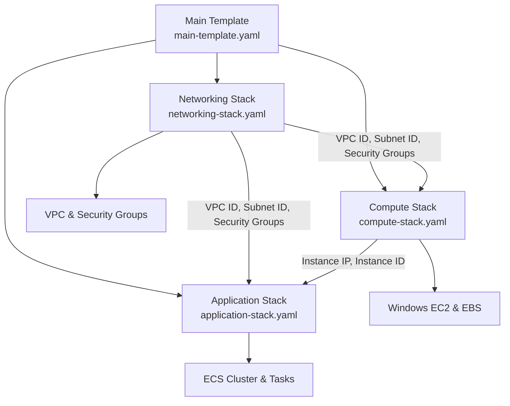
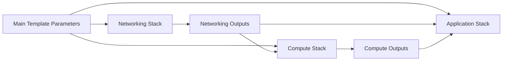

# CloudFormation Nested Templates

This directory contains the modular CloudFormation templates for the scheduled-file-writer application, organized into a nested stack architecture to overcome template size limits and improve maintainability.

## Template Architecture

### 🏗️ Main Template (`../main-template.yaml`)

**Purpose**: Orchestrates the deployment of all nested stacks (located in parent directory)

- **Size**: ~8,000 characters (well under CloudFormation limits)
- **Dependencies**: None (entry point)
- **Responsibilities**:
  - Parameter definitions and validation
  - Nested stack resource declarations
  - Cross-stack parameter passing
  - Output aggregation from all nested stacks
  - Dependency ordering enforcement

### 🌐 Networking Stack (`networking-stack.yaml`)

**Purpose**: Foundation networking infrastructure

- **Size**: ~25,000 characters
- **Dependencies**: None (deployed first)
- **Resources**:
  - VPC with private subnet
  - Security groups (ECS tasks, Windows EC2, VPC endpoints)
  - VPC endpoints (ECR, CloudWatch, SSM, EC2, KMS, Secrets Manager, CloudFormation)
  - Route tables and internet gateway
- **Outputs**: VPC ID, subnet IDs, security group IDs

### 💻 Compute Stack (`compute-stack.yaml`)

**Purpose**: Windows EC2 infrastructure for SMB file sharing

- **Size**: ~20,000 characters
- **Dependencies**: Networking Stack outputs
- **Resources**:
  - Windows Server 2022 EC2 instance (t3.micro)
  - EBS volume (20GB gp3) with attachment
  - IAM instance profile and roles
  - SSM associations for configuration
- **Outputs**: Instance ID, private IP address

### 🚀 Application Stack (`application-stack.yaml`)

**Purpose**: ECS containerized application infrastructure

- **Size**: ~15,000 characters
- **Dependencies**: Networking and Compute stack outputs
- **Resources**:
  - ECS Fargate cluster
  - Task definition with SMB connectivity
  - EventBridge scheduled rule
  - CloudWatch log groups
  - IAM task execution and task roles
- **Outputs**: ECS cluster ARN, task definition ARN

## Template Relationships



## Deployment Process

### 1. Template Upload

```bash
# Upload all templates to S3
./scripts/setup-nested-stacks.sh --profile YOUR_AWS_PROFILE --region YOUR_REGION
```

### 2. Validation

```bash
# Validate cross-stack references and template syntax
./scripts/validate-nested-stack-references.sh --profile YOUR_AWS_PROFILE --region YOUR_REGION
```

### 3. Deployment

```bash
# Deploy the complete nested stack architecture
./scripts/deploy-stack.sh --profile YOUR_AWS_PROFILE --region YOUR_REGION --ecr-uri YOUR_ECR_URI
```

## Template Validation

Each template is validated for:

- **Size Constraints**: Must be under CloudFormation's 51,200 byte limit
- **Syntax**: Valid CloudFormation YAML syntax
- **Cross-Stack References**: Proper parameter passing and output consumption
- **Resource Dependencies**: Correct dependency ordering
- **AWS Service Limits**: Compliance with AWS resource quotas

## Modification Guidelines

### Adding Resources

1. **Identify the correct stack** based on resource type and dependencies
2. **Add the resource** to the appropriate template
3. **Create outputs** if other stacks need to reference the resource
4. **Update cross-stack references** in dependent templates
5. **Validate and test** the changes

### Example: Adding a New Security Group

```yaml
# In networking-stack.yaml
NewSecurityGroup:
  Type: AWS::EC2::SecurityGroup
  Properties:
    GroupDescription: New security group
    VpcId: !Ref VPC
    # ... security group rules

# Add output
NewSecurityGroupId:
  Description: New Security Group ID
  Value: !Ref NewSecurityGroup
  Export:
    Name: !Sub "${ApplicationName}-new-sg-id"
```

### Template Size Management

- **Monitor sizes**: Use `wc -c *.yaml` to check template sizes
- **Optimize content**: Remove unnecessary comments and whitespace
- **Break down further**: If a template approaches limits, consider splitting it
- **Use references**: Prefer `!Ref` and `!GetAtt` over hardcoded values

## S3 Storage

Templates are automatically uploaded to an S3 bucket with the following structure:

```
s3://cf-templates-{account-id}-{region}-scheduled-file-writer/
├── main-template.yaml          # Main orchestration template
├── networking-stack.yaml       # Networking infrastructure
├── compute-stack.yaml          # Windows EC2 infrastructure
├── application-stack.yaml      # ECS application infrastructure
└── README.md                   # This documentation
```

**Bucket Configuration**:

- **Versioning**: Enabled (30-day retention for old versions)
- **Encryption**: AES-256 server-side encryption
- **Access**: Restricted to your AWS account and CloudFormation service
- **Lifecycle**: Automatic cleanup of incomplete uploads after 7 days

## Cross-Stack Parameter Flow



**Parameter Categories**:

- **Application Parameters**: Passed to all stacks (ApplicationName, etc.)
- **Network Parameters**: VPC CIDR, subnet configuration, availability zone
- **Compute Parameters**: Instance type, AMI ID, storage configuration
- **Application Parameters**: ECR URI, CPU architecture, scheduling

## Troubleshooting

### Common Issues

1. **Template Size Exceeded**: Break down large templates further
2. **Cross-Stack Reference Missing**: Ensure outputs exist and are properly exported
3. **S3 Upload Failed**: Check AWS credentials and S3 permissions
4. **Validation Failed**: Review CloudFormation syntax and resource properties

### Diagnostic Commands

```bash
# Check template sizes
wc -c infrastructure/nested-stacks/*.yaml

# Validate individual template
aws cloudformation validate-template --template-body file://networking-stack.yaml

# Check S3 bucket contents
aws s3 ls s3://YOUR_BUCKET_NAME/ --profile YOUR_AWS_PROFILE

# Monitor deployment progress
aws cloudformation describe-stack-events --stack-name scheduled-file-writer-stack
```

For detailed troubleshooting, see [../TROUBLESHOOTING.md](../TROUBLESHOOTING.md).

## Benefits

- ✅ **Size Limit Resolution**: Each template well under 51,200 character limit
- ✅ **Improved Maintainability**: Logical resource grouping
- ✅ **Modular Updates**: Update individual components independently
- ✅ **Better Error Isolation**: Failures contained to specific stacks
- ✅ **Parallel Development**: Teams can work on different stacks simultaneously
- ✅ **Enhanced Validation**: Comprehensive pre-deployment checks
- ✅ **Version Control**: Track changes to specific infrastructure components
- ✅ **Reusability**: Individual stacks can be reused across environments

---

**Generated on**: $(date)
**S3 Bucket**: s3://cf-templates-{ACCOUNT-ID}-{REGION}-scheduled-file-writer/
**Region**: {REGION}
